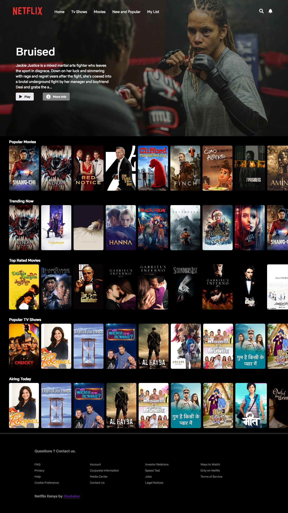
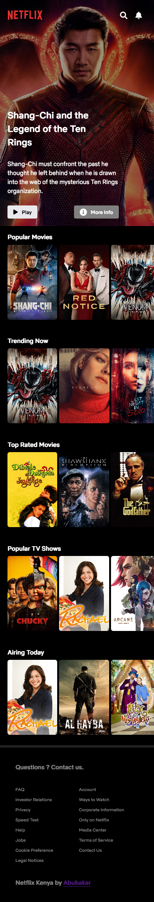

# Netflix Clone

## Table of contents

- [Overview](#overview)
  - [Screenshot](#screenshot)
  - [Links](#links)
  - [Built with](#built-with)
  - [What I learned](#what-i-learned)
  - [Useful resources](#useful-resources)
- [Author](#author)
- [Acknowledgments](#acknowledgments)

## Overview

Mobile responsive Netflix clone built with ReactJS, styled - component,react router , firebase and context api for state management 🚀

### Screenshot

## Desktop



## Mobile



### Links

- Live Site: [Heroku](https://flixnet-live.herokuapp.com/)

### Built with

- React Js
- Styled Component
- Axios
- Sass
- Firebase
- local state and context api
- TMDB api

### What I learned

```js
//custom hook for firebase auth
//wrapper provider component
const AuthProvider = ({ children }) => {
  const auth = useProvideAuth();
  return <AuthContext.Provider value={auth}>{children}</AuthContext.Provider>;
};
```

### Useful resources

- [React docs](https://beta.reactjs.org/) - The react js docs is very intuitive and easy to follow along

## Author

- Website - [Abubakar Ali](https://www.github.com/Devabubakar)

- Twitter - [Devabubakar](https://www.twitter.com/Devabubakar)

## Acknowledgments

- ps;; I forgot how to align a div inside a div - got help from stackoverflow
